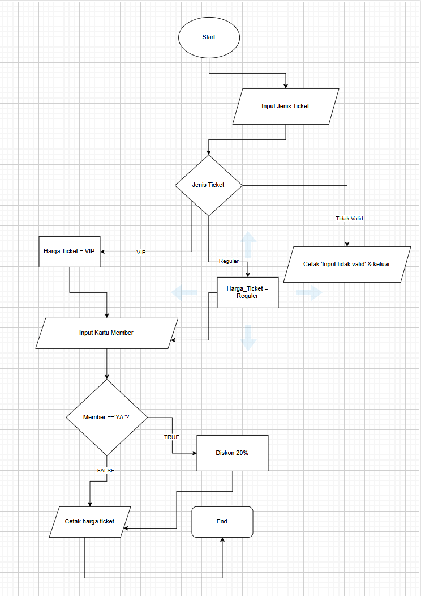
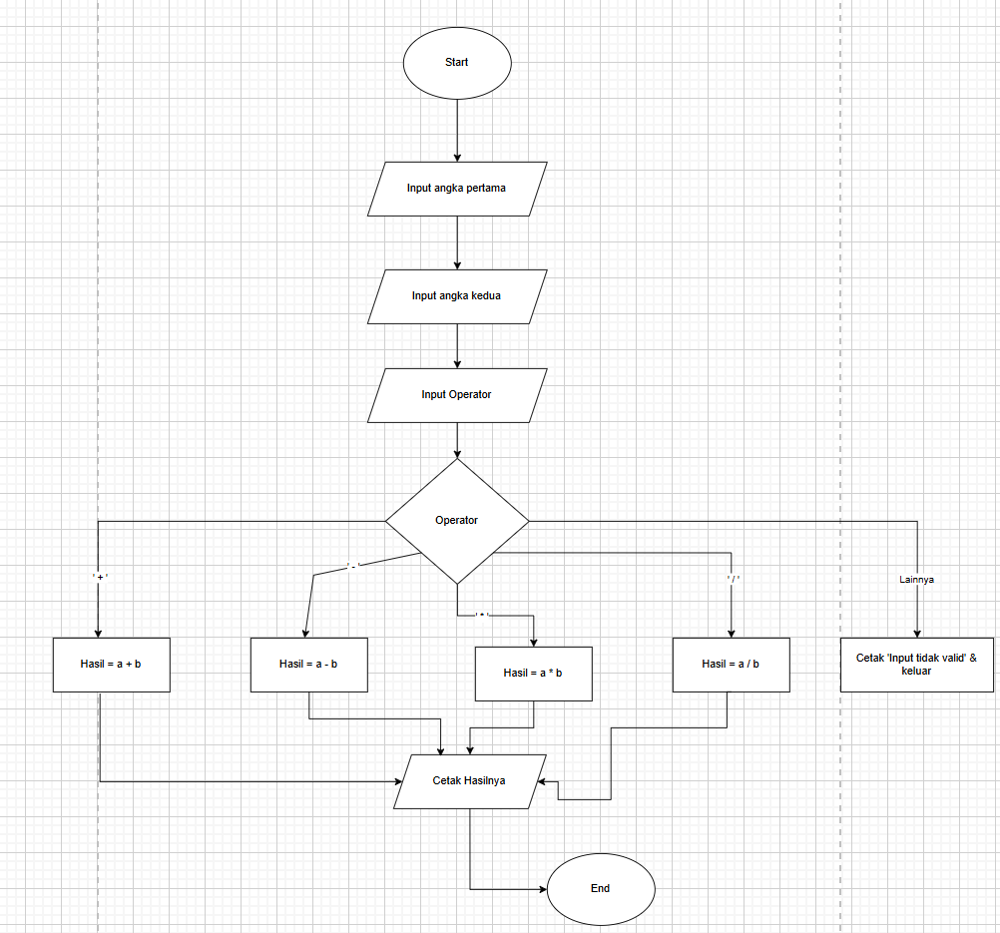

## kode program 
```python
 tipe_tiket = input("Masukkan tipe tiket (reguler/VIP): ").strip().lower()
status_member = input("Apakah Anda memiliki kartu member? (ya/tidak): ").strip().lower()
if tipe_tiket == "reguler":
    harga_tiket = 35000
elif tipe_tiket == "vip":
    harga_tiket = 90000
else:
    print("Tipe tiket tidak valid.")
    harga_tiket = 0
if status_member == "ya" and harga_tiket > 0:
    diskon = harga_tiket * 0.3
    total_harga = harga_tiket - diskon
else:
    total_harga = harga_tiket
if harga_tiket > 0:
    print(f"Total harga yang harus dibayar: Rp{total_harga:.2f}")
```

## output program
```markdown

Masukkan tipe tiket (reguler/VIP): reguler
Apakah Anda memiliki kartu member? (ya/tidak): tidak
Total harga yang harus dibayar: Rp35000.00

Masukkan tipe tiket (reguler/VIP): reguler
Apakah Anda memiliki kartu member? (ya/tidak): ya
Total harga yang harus dibayar: Rp24500.00

```

## Cara Kerja Program
Program ini menghitung harga tiket dengan mempertimbangkan jenis tiket yang dibeli (reguler atau VIP) dan apakah pembeli memiliki kartu member yang memberikan diskon. 

1. Input Jenis Tiket:
   ```python
   tipe_tiket = input("Masukkan tipe tiket (reguler/VIP): ").strip().lower()
   ```
   Program meminta pengguna untuk memasukkan jenis tiket yang diinginkan, yaitu "reguler" atau "VIP". Input tersebut diubah menjadi huruf kecil dan dihilangkan spasi di depan dan belakang untuk memastikan konsistensi, sehingga "VIP" atau "vip" tetap dianggap sama.

2. Input Status Member:
   ```python
   status_member = input("Apakah Anda memiliki kartu member? (ya/tidak): ").strip().lower()
   ```
   Program meminta pengguna untuk memasukkan status apakah mereka memiliki kartu member ("ya" atau "tidak"). Penggunaannya mirip dengan input sebelumnya: diubah menjadi huruf kecil dan dihilangkan spasi.

3. Menentukan Harga Tiket:
   ```python
   if tipe_tiket == "reguler":
       harga_tiket = 35000
   elif tipe_tiket == "vip":
       harga_tiket = 90000
   else:
       print("Tipe tiket tidak valid.")
       harga_tiket = 0
   ```
   - Jika pengguna memilih tiket reguler, maka `harga_tiket` diatur menjadi 35.000.
   - Jika pengguna memilih tiket VIP, maka `harga_tiket` diatur menjadi 90.000.
   - Jika input tipe tiket tidak sesuai (bukan "reguler" atau "VIP"), program akan menampilkan pesan "Tipe tiket tidak valid." dan `harga_tiket` diatur menjadi 0.

4. Menghitung Diskon untuk Member:
   ```python
   if status_member == "ya" and harga_tiket > 0:
       diskon = harga_tiket * 0.3
       total_harga = harga_tiket - diskon
   else:
       total_harga = harga_tiket
   ```
   - Jika pengguna adalah member (jawaban "ya") dan memilih tipe tiket yang valid (`harga_tiket > 0`), maka mereka mendapatkan diskon sebesar 30% dari `harga_tiket`.
   - Jika pengguna bukan member atau tipe tiket tidak valid, maka `total_harga` sama dengan `harga_tiket` tanpa diskon.

5. Menampilkan Total Harga:
   ```python
   if harga_tiket > 0:
       print(f"Total harga yang harus dibayar: Rp{total_harga:.2f}")
   ```
   - Jika harga tiket valid (`harga_tiket > 0`), program akan mencetak total harga yang harus dibayar, diformat hingga dua desimal (contoh: Rp35000.00).
Dengan struktur ini, program memastikan harga tiket dihitung dengan benar sesuai tipe tiket dan status keanggotaan pengguna.

## Output Program 
Output yang di peroleh menunjukkan bahwa kode program berjalan dengan benar sesuai logika yang diinginkan:

1. Kasus Pertama:
   - Input:
     - Tipe tiket: `reguler`
     - Status member: `tidak`
   - Proses:
     - Harga tiket untuk reguler adalah 35.000.
     - Karena tidak memiliki kartu member, pengguna tidak mendapatkan diskon.
   - Output:
     - Program menampilkan total harga tanpa diskon, yaitu `Rp35000.00`.

2. Kasus Kedua:
   - Input:
     - Tipe tiket: `reguler`
     - Status member: `ya`
   - Proses:
     - Harga tiket untuk reguler tetap 35.000.
     - Karena pengguna memiliki kartu member, ia mendapatkan diskon 30% dari harga tiket reguler.
       - Diskon = 30% × 35.000 = 10.500
       - Total Harga = 35.000 - 10.500 = 24.500
   - Output:
     - Program menampilkan total harga setelah diskon, yaitu `Rp24500.00`.

## flowchart program tiket bioskop
 

 
## kode program 
```python
# Fungsi untuk menghitung berdasarkan operator
def kalkulator(angka1, angka2, operator):
    if operator == "+":
        return angka1 + angka2
    elif operator == "-":
        return angka1 - angka2
    elif operator == "*":
        return angka1 * angka2
    elif operator == "/":
        if angka2 != 0:
            return angka1 / angka2
        else:
            return "Kesalahan: Pembagian dengan nol tidak diperbolehkan"
    else:
        return "Operator tidak valid"

# Meminta input dari pengguna
try:
    angka1 = float(input("Masukkan angka pertama: "))
    operator = input("Masukkan operator (+, -, *, /): ")
    angka2 = float(input("Masukkan angka kedua: "))

    # Menghitung hasil berdasarkan input
    hasil = kalkulator(angka1, angka2, operator)

    # Menampilkan hasil
    print(f"Hasil: {hasil}")

except ValueError:
    print("Input tidak valid! Pastikan Anda memasukkan angka.")
 ```

## output program
```
Masukkan angka pertama: 122
Masukkan operator (+, -, *, /): +
Masukkan angka kedua: 12
Hasil: 134.0
Masukkan angka pertama: 130 
Masukkan operator (+, -, *, /): *
Masukkan angka kedua: 2
Hasil: 260.0

```
## Cara kerja program

Di dalam kode, ada fungsi bernama `kalkulator` yang menerima dua angka dan sebuah operator sebagai input. Fungsi ini memeriksa operator yang diberikan. Jika operatornya adalah tanda tambah, fungsi akan menjumlahkan kedua angka. Jika tanda kurang, fungsi akan mengurangkan. Untuk perkalian dan pembagian, fungsi akan melakukan operasi yang sesuai, tetapi untuk pembagian, ada pengecekan tambahan untuk memastikan bahwa angka kedua tidak sama dengan nol. Jika angka kedua nol, fungsi akan memberikan pesan kesalahan, karena pembagian dengan nol tidak diperbolehkan.

Setelah mendefinisikan fungsi tersebut, kode meminta pengguna untuk memasukkan angka pertama, operator, dan angka kedua. Jika pengguna memasukkan nilai yang tidak valid (seperti teks alih-alih angka), program akan menangkap kesalahan tersebut dan memberi tahu pengguna bahwa input yang dimasukkan tidak valid.

Setelah semua input diterima, kode akan memanggil fungsi `kalkulator` dan menyimpan hasilnya. Kemudian, hasil ini akan ditampilkan. Jika hasilnya adalah angka, kode akan menampilkannya dengan dua angka desimal. Jika ada kesalahan dalam perhitungan (seperti operator yang tidak valid atau pembagian dengan nol), pesan kesalahan akan ditampilkan.

Secara keseluruhan, kode ini adalah contoh yang baik tentang bagaimana membuat aplikasi interaktif yang menerima input dari pengguna dan memberikan hasil berdasarkan logika yang ditentukan. 

## flowchart program kalkulator
 
